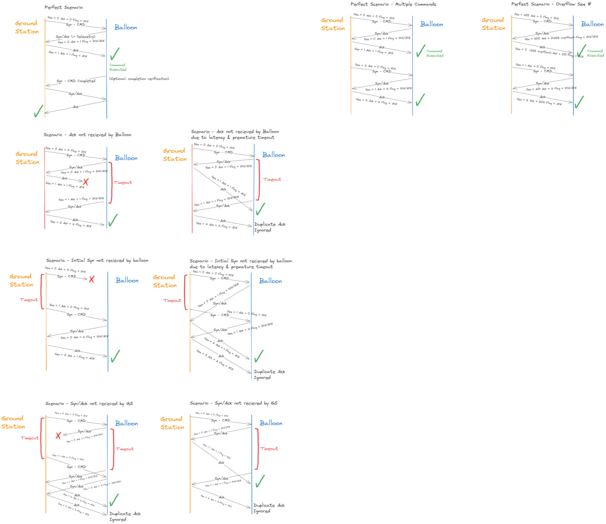

# Communication Protocol

The protocol is being developed in this directory. Source code is under [src](src) and tests used to test the protocol behaviour are under [test](test).

## Protocol Requirements

    - Reliable communication (ack system)
    - Half-duplex communication **** LORA IS HALF DUPLEX - ONLY ONE DEVICE CAN TRANSMIT AT A TIME
    - Error detection - Checksum
    - Forward Error correction **** FEC IS BUILT INTO LORA
        - Repetition
    - Low Data Rate (small packets)
    - Support for future expandability

### Packet Structure:

```plaintext

+-+-+-+-+-+-+-+-+-+-+-+-+-+-+-+-+-+-+-+-+-+-+-+-+-+-+-+-+-+-+-+-+
|                           Callsign                            |
+-+-+-+-+-+-+-+-+-+-+-+-+-+-+-+-+-+-+-+-+-+-+-+-+-+-+-+-+-+-+-+-+
0                   1                   2                   3
0 1 2 3 4 5 6 7 8 9 0 1 2 3 4 5 6 7 8 9 0 1 2 3 4 5 6 7 8 9 0 1 bits
              1               2               3               4 bytes
+-+-+-+-+-+-+-+-+-+-+-+-+-+-+-+-+-+-+-+-+-+-+-+-+-+-+-+-+-+-+-+-+
|         Flags/Options        |      Seq #    |     Ack #      |
+-+-+-+-+-+-+-+-+-+-+-+-+-+-+-+-+-+-+-+-+-+-+-+-+-+-+-+-+-+-+-+-+
|     Tag     |  Data Length   |            Checksum            |
+-+-+-+-+-+-+-+-+-+-+-+-+-+-+-+-+-+-+-+-+-+-+-+-+-+-+-+-+-+-+-+-+
|                            Data                               |
+-+-+-+-+-+-+-+-+-+-+-+-+-+-+-+-+-+-+-+-+-+-+-+-+-+-+-+-+-+-+-+-+
```

- Flags/Options: Mostly used for future expandability/optimization as the protocol develops, and for Syn/Ack flags - Type(T):

  - Packet Type (included within the first 2 bits)
    - Idle - 00 - (no data) only sends periodically to keep connection alive (or can be sent by balloon to sense if balloon is in range)
    - Command - 01 - includes SYN/ACK flags for connection (similar to TCP)
    - Telemetry - 10 - Best effort (like UDP) - ground station periodically sends request for telemetry data, since response not guaranteed a connection based request could also be implemented if needed (idea: send telemetry data with each ack)
    - More if needed
  - Syn/Ack Flags: last 2 bits (more if needed)
    - SYN - 01 - Used to initiate a connection
    - SYN/ACK - 11 - Used to acknowledge a connection and initiate a connection
    - ACK - 10 - Used to acknowledge a connection

- Sequence Number: 4 bits

  - Used to keep track of number of packets resent in the event of a timeout

- Acknowledgement Number: 4 bits

  - Used to acknowledge packets received, this number is equal to the sequence number of the packet being acknowledged + 1

- Checksum: Ensures packet header integrity

- Data: TLV ([Tag, Length], Value)
  - Tag = Command or Type of data being sent - 1 byte
  - Length = Length of Value - 1 byte
  - Value = Data - `Length` bytes - Padded using PKCS#7

## Protocol Behavior

Sequence # = 0 marks the beginning of a new communication session. After each packet SYN (or SYN/ACK) packet is sent, a timer is started to wait for an SYN/ACK with an ACK number of 1 [Seq#+1]. If the timer expires, the packet is resent and the sequence number is incremented. If the number of resends exceeds a threshold (254), the connection is terminated.

When the SYN/ACK packet is recieved, the sequence number to the final outbound ACK packet remains the same as the initial packet that was recieved by the balloon. (This can also be calculated by subtracting the seq# from the ack# in the SYN/ACK packet and subtracting 1 from it). And the acknowledgement number is set to the sequence number of the SYN/ACK packet + 1. Now since both sides have acknowledged the connection, the balloon can execute the command in the packet.

If a duplicate SYN/ACK packet is recieved, the ground station will resend a duplicate ACK packet. If the balloon recieves a duplicate ACK packet, it will ignore it.

If the ACK is not recieved by the balloon before the timeout, the SYN/ACK packet will be resent and the sequence and acknowledge number will be incremented. It will then wait for the appropriate ACK packet.

> Below is a visualisation of the protocol behavior with different test cases:



---

# How to run tests

From the root directory of the communication protocol project run the following command:

```bash
> export PYTHONPATH=src
```

Then run the following command to run the tests:

```bash
> pytest test
```

or for a specific test file:

```bash
> pytest test/test_file.py
```
