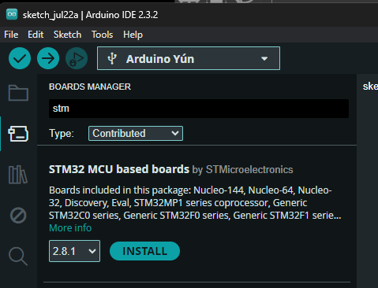
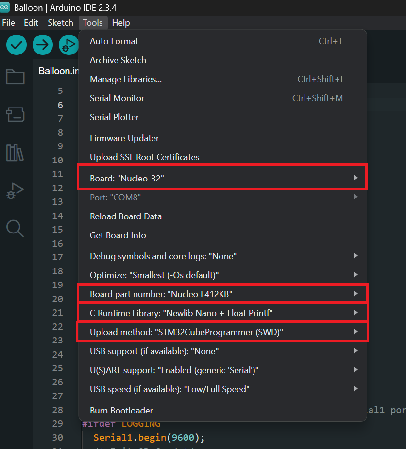

# Balloon Venting System

Table of Contents

1. [Set-up for Programming and Uploading Code](#programming-and-uploading-code)
2. [Balloon Code](#balloon-code)
   1. [Dependencies](#dependencies)
   2. [Other](#other)

## Programming and Uploading Code

> The balloon venting system uses an STM32 microcontroller and can be programmed using the Arduino IDE. Therefore, there are steps that need to be taken to set up the IDE with the STM32 MCU.

1. Install the [Arduino IDE 2](https://www.arduino.cc/en/software) (v2 is Required)
2. Install the [STM32 board package](https://github.com/stm32duino/Arduino_Core_STM32/wiki/Getting-Started):

   - Open the Arduino IDE
   - Go to File > Preferences
   - In the "Additional Board Manager URLs" field, add the following URL:
     - <https://github.com/stm32duino/BoardManagerFiles/raw/main/package_stmicroelectronics_index.json>
   - Click on "Tools" menu and then "Boards > Boards Manager"
   - Select "Contributed" and type stm and "STM32 MCU based boards" will show up. Install the latest version

     

3. Install the [STM32CubeProgrammer](https://www.st.com/en/development-tools/stm32cubeprog.html) in order to upload the code to the stm32 more effectively. (HIGHLY RECCOMENDED)

Now the STM32 can be programmed using the Arduino IDE, however there are things to consider when uploading code.

Under "Tools", make sure:

- **Board:** "Nucleo-32"
- **Board part number:** "Nucleo L412KB" or "Nucleo L412KC" depending on which is currently being used.
- **C Runtime Library:** "Newlib Nano + Float Printf"
  - If "float printf" is not enabled, logging will not log data values as expected. However this can be left default if logging is disabled in [Balloon.ino](/BalloonCode/ArduinoIDE_Sketches/Balloon/Balloon.ino)
- **Upload method:** "STM32CubeProgrammer (SWD)" - Requires STM32CubeProgrammer to be installed
  - This option yielded the best results when uploading, "Mass Storage" seemed to have issues. Feel free to experiment with different methods. One thing to note, there seems to be an issue with programming a device when multiple stm boards are connected. So for now, only connect the board you are programming when the code is uploading to the board.

## Balloon Code

> "Servo.h" may cause some problems after installing STM32duino board manager. The best workaround is to change the Servo folder and Servo.h file name in the arduino library to something different "e.g. Servo_ardu.h"

The balloon code includes [Balloon.ino](/BalloonCode/ArduinoIDE_Sketches/Balloon/Balloon.ino) and [Balloon.h](/BalloonCode/ArduinoIDE_Sketches/Balloon/Balloon.h) which have detailed comments to explain the code as well as how to add onto it.

**REQUIRED**: Before uploading any code make sure to put both files in [Modified RadioHead](/BalloonCode/Modified_RadioHead/README.md) into the RadioHead library source. Most likely under `Documents/Arduino/libraries/RadioHead`. More information is in the README in that folder

### Dependencies

- [RadioHead](https://www.airspayce.com/mikem/arduino/RadioHead/)
  - Type Radiohead into the library manager. Author: Mike McCauley
- [TinyGPS](https://github.com/neosarchizo/TinyGPS)
  - Type TinyGPS into the library manager. Author: Mikal Hart

### Other

We also provide example/test sketches that we used for range testing under the [test sketches](/BalloonCode/ArduinoIDE_Sketches/test_sketches/) directory.

The [psuedo-ground station](/BalloonCode/ArduinoIDE_Sketches/PseudoGroundStation/PseudoGroundStation.ino) was used as a preliminary version of the ground station for testing purposes.
