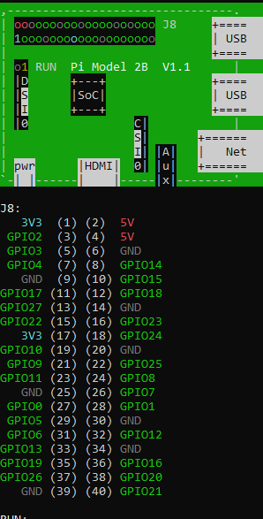

# User Interface in Python [UI](UI/)

Table of Contents

- [Desktop file](#desktop-file)
- [Basic Setup](#basic-setup)
- [Setup virtualenv (optional)](#setup-virtualenv-optional)
- [How to use UI module](#how-to-use-ui-module)
- [RFM95 Wiring](#rfm95-wiring)

## Desktop file

Put the GUI.desktop on the desktop and double click it to run

## Basic setup

> Name: balloon or
>
> Name: HAB

> Password: balloon or
>
> Password: HAB@VT

> `pip install virtualenv` if you don't have it installed (most likely you do if you have python3).

## Setup virtualenv (optional)

### Linux

1. Create a virtual environment

   ```bash
   python3 -m venv .venv
   ```

2. Activate the virtual environment

   ```bash
   source .venv/bin/activate
   ```

3. Install dependencies

   ```bash
   pip install -r requirements.txt
   ```

### Windows

1. Create a virtual environment

   ```bash
   python -m venv .venv
   ```

2. Activate the virtual environment

   ```bash
   .venv\Scripts\activate
   ```

3. Install dependencies

   ```bash
   pip install -r requirements.txt
   ```

> To deactivate the virtual environment, run `deactivate` in the terminal.

> **Alternatively you can install all dependencies directly to the raspberrypi which will work and is the preferred method.**

## How to use UI module

Assuing venv is set up, type

```bash
export PYTHONPATH={PATH TO FOLDER THAT INCLUDES UI FOLDER}
```

> For example, if the UI directory is in my current directory <br> > `export PYTHONPATH=./UI`
>
> Update: use `export PYTHONPATH={FULL PATH TO FOLDER THAT INCLUDES THE UI FOLDER}`. In this case it would be `export PYTHONPATH=/home/{user}/SP25-20/RaspberryPi`. This works better when used from anywhere in the system.

After this you can use

```bash
python3 -m UI {followed by flags}
```

to run the program

For help, run

```bash
python3 -m UI [-h|--help]

usage: __main__.py [-h] [-t] [-D]

optional arguments:
  -h, --help   show this help message and exit
  -t, --tui    Launch textual user interface
  -D, --debug  Enable debug logging
```

## RFM95 Wiring

| RFM95 Pin | Raspberry Pi Pin |
| --------- | ---------------- |
| Vin       | 3.3V             |
| GND       | GND              |
| SCK       | GPIO 11 (SCLK)   |
| MISO      | GPIO 9 (MISO)    |
| MOSI      | GPIO 10 (MOSI)   |
| CS        | GPIO 20          |
| RST       | GPIO 19          |



The Cutdown function doesn't do anything currently since we only had access to the motor. Reimplement with your way of cutting down the balloon.
