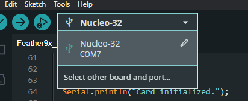

# Using the serial logger (for ground station logging)

## Directions

> `pip install virtualenv` if you don't have it installed (most likely you do if you have python3).

### Linux

1. Create a virtual environment

   ```bash
   python3 -m venv .venv
   ```

2. Activate the virtual environment

   ```bash
   source .venv/bin/activate
   ```

3. Install dependencies

   ```bash
   pip install -r requirements.txt
   ```

### Windows

1. Create a virtual environment

   ```bash
   python -m venv .venv
   ```

2. Activate the virtual environment

   ```bash
   .venv\Scripts\activate
   ```

3. Install dependencies

   ```bash
   pip install -r requirements.txt
   ```

> To deactivate the virtual environment, run `deactivate` in the terminal.

## To run the logger

```bash
python3 seriallog.py {Serial Port} {Log Filename+.txt/.log}
```

> Ex.
> python3 seriallog.py COM7 log.txt

To find what serial port your device is on. An easy way to find out is to go to the Arduino Ide and select the board/port at the top. It will automatically list the available/compatible ports.



> In my case I would use COM7
